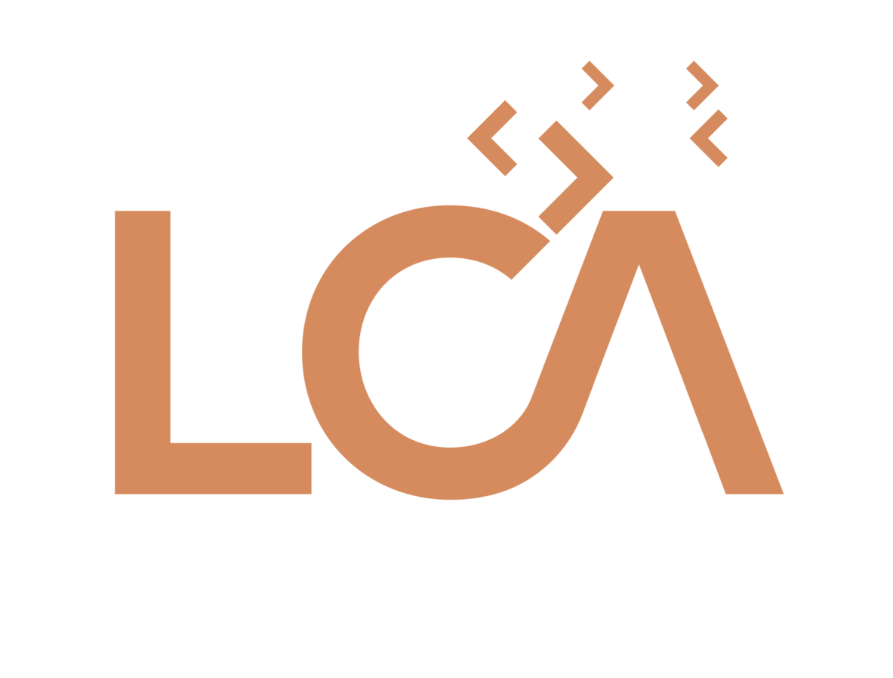
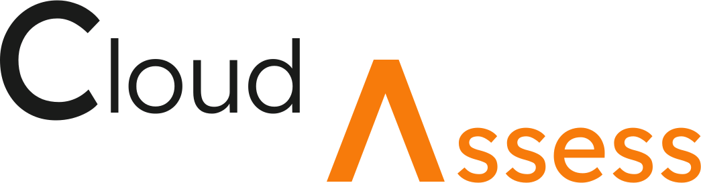
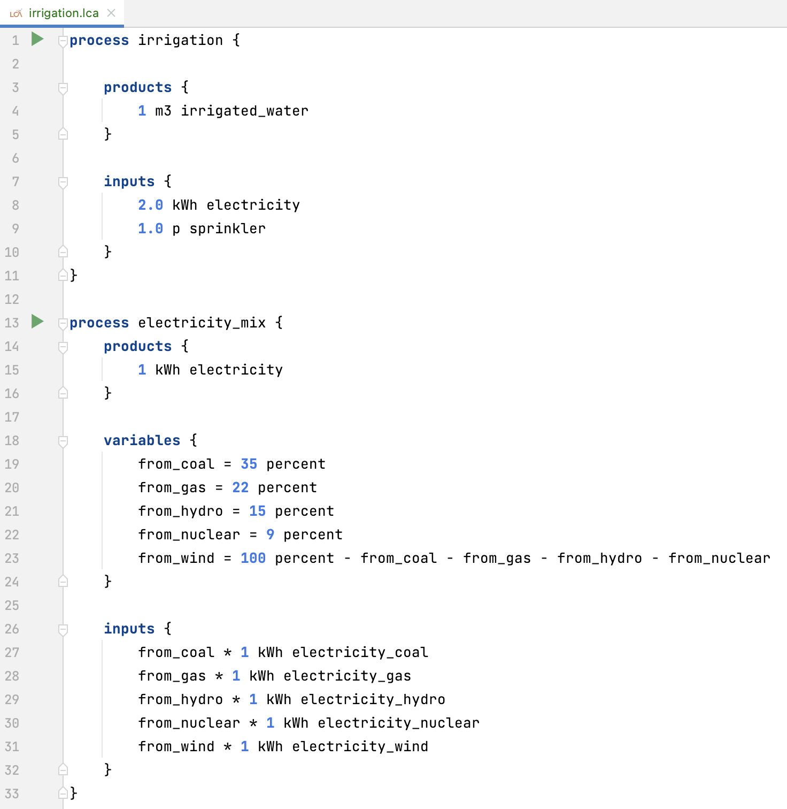

# LCA as Code


This is the official repository of LCA as Code language.

## What is LCA as Code?

LCA as Code is a domain-specific language (DSL) for life-cycle analysis experts.
Its *declarative* approach enables to seamlessly define *parametrized* and *reusable* LCA models.



```lca
process electricity_production_mix {
    params {
        hydro = 20 percent
        nuclear = 30 percent
        fossil = 50 percent
    }
    products {
        1 kWh electricity
    }
    inputs {
        hydro * 1 kWh electricity from hydroelectric_production
        nuclear * 1 kWh electricity from nuclear_production
        fossil * 1 kWh electricity from fossil_production
    }
}
```

## Table of Contents

1. [What's inside](#whats-inside)
2. [Related projects](#related-projects)
3. [License](#license)
4. [About us](#about-us)

## What's inside

This repository contains the core libraries to handle LCAAC code.

### Package `core`

The package `core` contains:
- the language's abstract syntax tree (AST)
- the evaluator
- analysis programs, namely, contribution analysis, and local sensitivity analysis

### Package `grammar`

The package `grammar` contains:
- a concrete ANTLR-based grammar
- utilities to parse and load LCAAC files.

## Related projects

### Cloud Assess



[Cloud Assess](https://github.com/kleis-technology/cloud-assess) is an open-source tool 
to automate the assessment of the environmental impacts of cloud services.
It aims at defining a *trusted library* of LCA models, written in the LCAAC language,
which can be easily consulted via a REST API.

### LCA as Code IDE



An integrated-development environment (IDE) is [available](https://lca-as-code.com).
This editor provides facilities to develop and interact with LCAAC models. E.g.
- Automatic unit consistency check with syntax highlighting.
- Integrated analysis and visualization.
- Support for collaboration and code review.

## License

This work is dual licensed:
- For commercial use: commercial license. Reach out to `contact@kleis.ch` for more information.
- For non-commercial use: AGPL v3. See `LICENSE-AGPL.txt`.

## About us


We are [Kleis Technology](https://kleis.ch).
Software craftsmen, thirsty for knowledge, with experience in complex subjects, we solve challenges in a pragmatic manner. 
Backed by our core values of trust, commitment and continuous improvement, we love to make and create.
