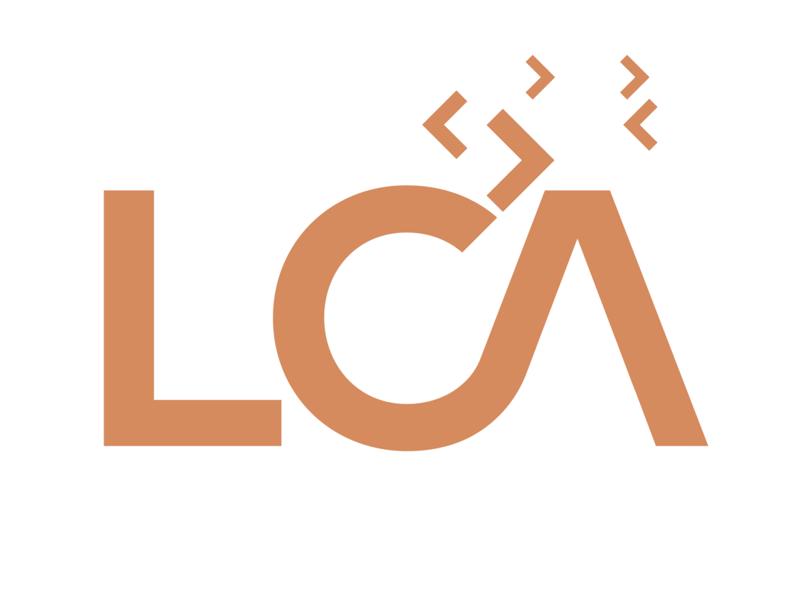
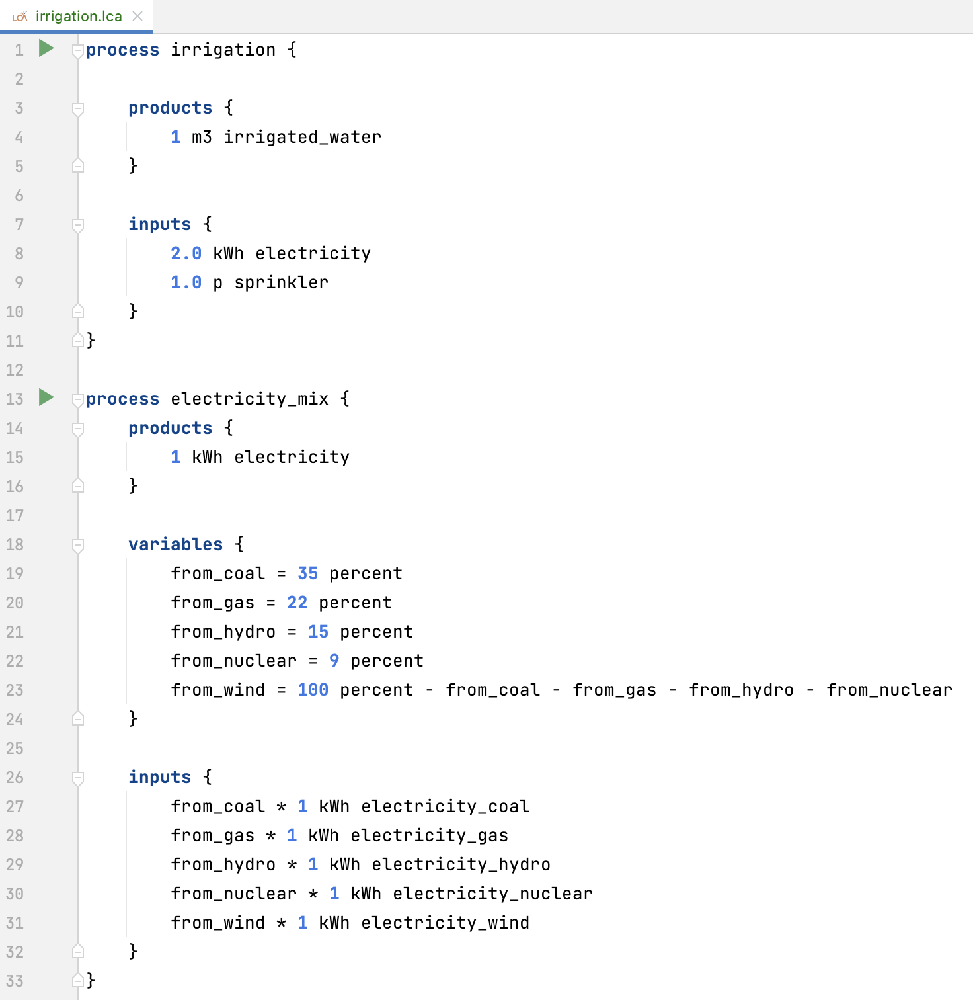

# LCA as Code


This is the official repository of LCA as Code language.

## What is LCA as Code?

LCA as Code is a domain-specific language (DSL) for life-cycle analysis experts.
Its *declarative* approach allows to define *parametrized* and *reusable* LCA models.
See our [book](https://lca-as-code.com/book) to learn more about the language.



## Table of Contents

1. [Getting started](#getting-started)
2. [What's inside](#whats-inside)
3. [Documentation](#documentation)
4. [Related projects](#related-projects)
5. [License](#license)
6. [About us](#about-us)

## Getting started

### Install

From the source
```bash
git checkout v2.3.0
./gradlew :cli:installDist
alias lcaac=$GIT_ROOT/cli/build/install/lcaac/bin/lcaac
lcaac version
```

From Homebrew
```bash
brew tap kleis-technology/lcaac
brew install lcaac-cli
lcaac version
```

### Impact assessment

Check the sample file in `$GIT_ROOT/cli/samples/main.lca`.

```lca
process electricity_mix {
    params {
        from_fossil = 40 percent
        from_nuclear = 20 percent
        from_hydro = 40 percent
    }
    products {
        1 kWh electricity
    }
    inputs {
        from_fossil * 1 kWh electricity from fossil
        from_nuclear * 1 kWh electricity from nuclear
        from_hydro * 1 kWh electricity from hydro
    }
}
// rest of the file omitted
```


Now you can assess the process `electricity_mix`.
```bash
cd $GIT_ROOT/cli/samples
lcaac assess "electricity_mix"
```
The result is printed on the standard output in tabular format.
```
product      amount  reference unit  co2  co2_unit
-----------  ------  --------------  ---  --------
electricity  1.0     kWh             5.4  kg
```

Use `-o csv` or `-o json` for machine-readable output, and `-i <indicator>` to filter the indicators shown.
```bash
lcaac assess "electricity_mix" -o csv
lcaac assess "electricity_mix" -o json -i co2
```

You can also run multiple assessments with an external data csv file providing values for the process parameters.
```bash
lcaac assess "electricity_mix" --file params.csv
```

### Graph

The `graph` command renders the process supply chain as a [Mermaid](https://mermaid.js.org) flowchart.

```bash
cd $GIT_ROOT/cli/samples
lcaac graph "electricity_mix"
```

```
flowchart BT
    classDef invisible fill:none,stroke:none
    ep0[ ]:::invisible
    prod0["electricity_mix"]
    prod1["fossil"]
    prod2["nuclear"]
    prod3["hydro"]
    prod0 -->|"electricity"| ep0
    prod1 -->|"electricity"| prod0
    prod2 -->|"electricity"| prod0
    prod3 -->|"electricity"| prod0
```

Use `-o html` to get a self-contained HTML page with the graph rendered in the browser.
```bash
lcaac graph "electricity_mix" -o html > graph.html
```

Use `-i <indicator>` to display each process's contribution to an indicator on the edges.
By default, the contribution is shown as a percentage; use `--absolute` for absolute values.
```bash
lcaac graph "electricity_mix" -i co2
lcaac graph "electricity_mix" -i co2 --absolute
```

Additional display options: `--show-biosphere`, `--show-impacts`, `--show-quantities`, `--hide-products`.

### Tests

The language allows to define tests as well. See the file `$GIT_ROOT/cli/samples/test.lca`.

```lca
test should_pass {
    given {
        1 kWh electricity from electricity_mix
    }
    assert {
        co2 between 0 kg and 10 kg
    }
}
// rest of the file omitted
```

Run the tests using
```bash
lcaac test --show-success
```

## What's inside

This repository contains the core libraries to handle LCAAC code.

### Package `core`

The package `core` contains:
- the language's abstract syntax tree (AST)
- the evaluator
- analysis programs, namely, contribution analysis, and local sensitivity analysis

### Package `grammar`

The package `grammar` contains:
- a concrete ANTLR-based grammar
- utilities to parse and load LCAAC files.

### Package `cli`

The package `cli` contains the code for the command-line interface.

## Documentation

For users
- [Walkthrough](https://lca-as-code.com/book)
- [Code samples](./tutorials/README.md)

For developers
- [Release management](./RELEASE-MANAGEMENT.md)
- Core concepts *\[coming soon\]*
- Contribution guide *\[coming soon\]*

## Related projects

### Cloud Assess


[Cloud Assess](https://github.com/kleis-technology/cloud-assess) is an open-source tool 
to automate the assessment of the environmental impacts of cloud services.
It aims at defining a *trusted library* of LCA models, written in the LCAAC language,
which can be easily consulted via a REST API.

### LCA as Code IDE



An integrated-development environment (IDE) is [available](https://lca-as-code.com).
This editor provides facilities to develop and interact with LCAAC models. E.g.
- Automatic unit consistency check with syntax highlighting.
- Integrated analysis and visualization.
- Support for collaboration and code review.

## License

This work is dual licensed (see [LICENSE](LICENSE.txt)):
- AGPL v3
- or commercial license. 
Reach out to `contact@kleis.ch` for more information.

## About us


We are [Kleis Technology](https://kleis.ch).
Software craftsmen, thirsty for knowledge, with experience in complex subjects, we solve challenges in a pragmatic manner. 
Backed by our core values of trust, commitment and continuous improvement, we love to make and create.
